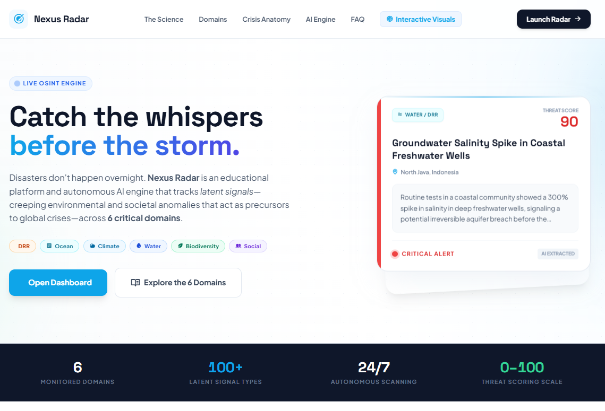
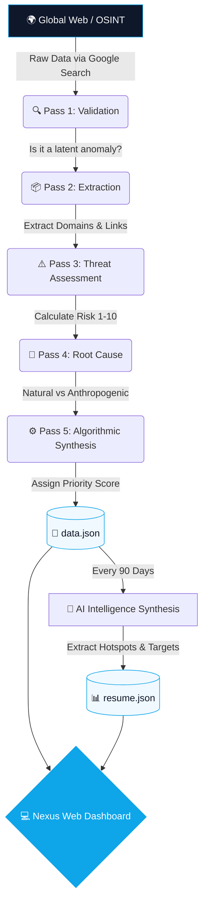

# 🎯 Nexus Radar
> **Catch the whispers before the storm.**  
> An autonomous AI-powered OSINT engine detecting latent environmental and societal anomalies before they escalate into global crises.

[](https://www.gnu.org/licenses/gpl-3.0)
[]()
[]()
[]()

  


---

## 📖 The Vision: Why "Latent Signals"?

Traditional disaster management operates on a **reactive paradigm**—mobilizing resources only *after* a catastrophe strikes. However, crises are rarely sudden; they are preceded by subtle, creeping anomalies known as **Latent Signals** (e.g., localized mass coral bleaching, a sudden drop in well water pressure, or isolated 'test burns' in a forest).

**Nexus Radar** defeats human cognitive biases (like Normalcy and Survivorship Bias) by autonomously scanning the web for these early indicators across 6 scientific domains:  
🌊 **Ocean** | ☁️ **Climate** | 🌋 **DRR** | 💧 **Water** | 🌱 **Biodiversity** | 👥 **Social/Behavioral**

---

## 🧠 System Architecture & AI Pipeline

Nexus Radar runs on a fully automated **5-Layer AI Pipeline** powered by Google Gemini. The engine autonomously searches, filters, and structures unstructured web data into a policy-ready database.



---

## 📂 Repository Structure

The project is designed to be lightweight, serverless, and easily deployable.

```text
nexus-radar/
├── .github/workflows/
│   └── main.yml          # GitHub Actions automation script (Cron Job)
├── scraper.py            # Python Core Engine (Gemini AI integration)
├── index.html            # Landing Page (SEO Friendly)
├── radar.html            # Signal Inventory & Dashboard App
├── info.html             # Educational Domain Analytics Visualizer
├── data.json             # Automated Append-Only Signal Database
└── resume.json           # Automated Quarterly Synthesis Reports
```

---

## 💻 Example Output Data

The engine standardizes messy OSINT data into a clean, actionable JSON format. Here is a snippet of what the AI produces inside `data.json`:

```json
{
    "id": "sig-899405a1664fdb739",
    "timestamp": "2026-04-15T18:21:06",
    "title": "Groundwater Salinity Spike in Freshwater Wells",
    "domain_classification": ["Water", "DRR"],
    "location": {
        "country": "Indonesia",
        "region": "North Java",
        "lat": -6.2088,
        "lon": 106.8456
    },
    "escalation": {
        "speed": "slow",
        "urgency": "high"
    },
    "risk_assessment": {
        "risk_score": 9,
        "risk_type": ["fatal resource loss", "irreversible"],
        "severity_level": "high"
    },
    "priority_score": 90,
    "critical_flag": true
}
```

---

## ⚙️ Configuration

You can easily tweak the engine's behavior by modifying the environment variables inside `.github/workflows/main.yml`.

| Environment Variable | Default Value | Description |
| :--- | :--- | :--- |
| `DATA_INTERVAL_DAYS` | `1` | How often the engine searches for new signals (in days). |
| `RESUME_INTERVAL_DAYS` | `90` | How often the AI generates a new Synthesis Report. |
| `MAX_ITEMS_PER_RUN` | `2` | Maximum number of new signals to append to the database per run. |
| `GEMINI_MODEL` | `gemini-3-flash-preview` | The specific Gemini LLM model to use for inference. |
| `RUN_TYPE` | `auto` | Accepts `force_data`, `force_resume`, or `force_both` for manual trigger. |

---

## 🚀 Deployment Guide (100% Free)

You can run your own instance of Nexus Radar entirely for free using GitHub Actions and GitHub Pages. No backend server required.

### 1. Fork & Clone
Fork this repository to your own GitHub account.

### 2. Get API Key
Get a free API key from [Google AI Studio (Gemini)](https://aistudio.google.com/).

### 3. Set Up GitHub Secrets
1. Go to your repository **Settings** > **Secrets and variables** > **Actions**.
2. Click **New repository secret**.
3. Name: `GEMINI_API_KEY`
4. Secret: *(Paste your Google Gemini API Key here)*

### 4. Enable GitHub Pages
1. Go to **Settings** > **Pages**.
2. Under "Build and deployment", set the source to **Deploy from a branch**.
3. Select the `main` branch and `/ (root)` folder, then save.
4. Your dashboard will be live at `https://[your-username].github.io/[repo-name]/`.

### 5. Trigger the Engine
1. Go to the **Actions** tab in your repository.
2. Select **Latent Signal Auto-Crawler** on the left menu.
3. Click **Run workflow**, choose `force_both` to generate your first batch of data immediately.
4. From now on, the script will run automatically every day at midnight (UTC).

---

## ⚠️ Disclaimer
This tool utilizes Large Language Models (LLMs) to synthesize data from Open-Source Intelligence (OSINT). While the engine is instructed to seek verified sources, AI outputs can occasionally produce hallucinations or misinterpret data. **This tool is for research, educational, and early-warning screening purposes only** and should not replace professional ground-truth scientific assessments.

---

## ⚖️ License

This project is licensed under the **GNU General Public License v3.0 (GPL-3.0)**.

You are free to use, study, share, and modify this software. However, if you distribute modified versions of this software, you **must** make the source code available under the same GPL-3.0 license.

See the [LICENSE](LICENSE) file for more details.

---
<p align="center">
  <i>Built to map the invisible. Designed for the future of our planet. 🌍</i>
</p>
